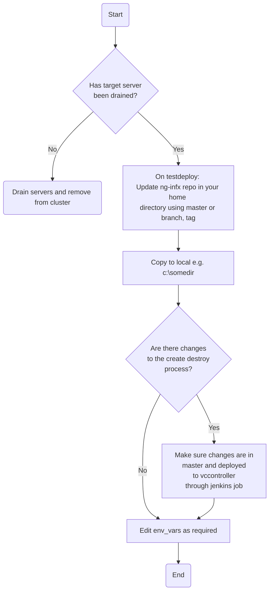

# Mermaid Examples

## Create/Destroy Flowchart

```mermaid
    graph TD;
    Start(Start) --> Drained{Has target server <br> been drained?}
    Drained -- No --> End1(Drain servers and remove from cluster)
    Drained -- Yes --> UpdateRepo[On testdeploy: <br>Update ng-infx repo in your home <br>directory using master or branch, tag]
    UpdateRepo --> CopyLocal[Copy to local e.g. c:\somedir]
    CopyLocal --> CreateDestroyChanges{Are there changes<br> to the create destroy <br> process?}
    CreateDestroyChanges -- No --> EditEnvVars[Edit env_vars as required]
    EditEnvVars --> End2(End)
    CreateDestroyChanges -- Yes --> ConfirmChangesInGit[Make sure changes are in <br> master and deployed <br> to vccontroller <br> through jenkins job]
    ConfirmChangesInGit --> EditEnvVars
```
